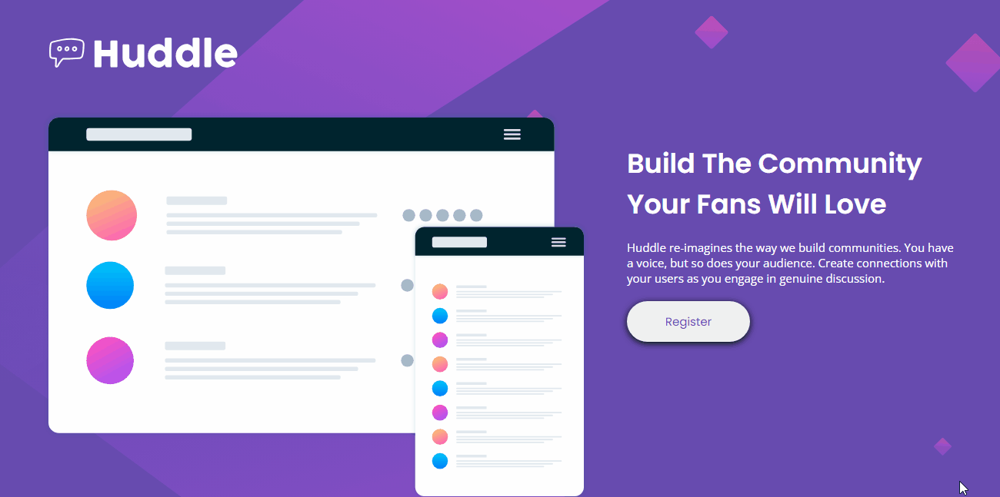
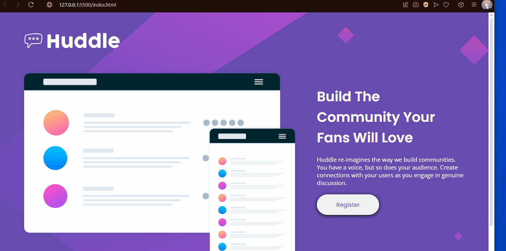
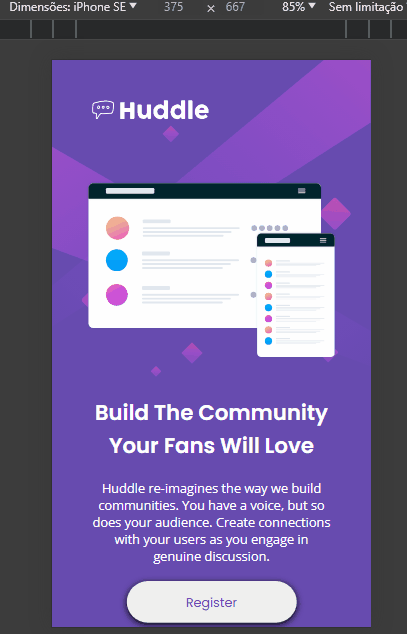

# Olá! Prazer!

Me chamo Gustavo, é a primeira quest que realizo e mando aqui no grupo do discord, a seguir irei descrever algumas dificuldade e facilidades que tive ao realizar o projeto huddle landing page.

# Facilidades

No geral achei o projeto bem fácil, comparado com os exercícios dos módulos de flex achei toda a ideia bem simples até, talvez isso signifique que agora consigo identificar mais fácil os elementos de um projeto e quais propriedades devo utilizar em casa área dele. Por exemplo sinto que atualmente consigo montar muito melhor um html decente, algo que me complicou bastante nos exercicios passados, também sinto que agora domino mais o flex e como utiliza-lo para alocar os elementos na página, não perdi tempo tentando deixar um elemento centralizado ou em algum canto pois já sabia a melhor forma de fazer isso.

# Dificuldades

Demorei muito mais nessa quest do que eu esperava, e não por não saber como fazer algo, mas sim por não saber se essa forma estaria certa. O que fez com que eu demorasse para termina-lo foi por conta das imagens do design do projeto serem bem grandes, e quando utilizadas em meu monitor o projeto ficava muito maior do que minha tela, nisso fiquei perdendo muito tempo pensando se deveria fazer o projeto com outras medidas ou se deveria apenas utilizar as imagens da forma como recebi elas, acabei optando pela segunda opção. Não sei se fiz o correto em fazer isso, mas o projeto ficou grande em minha tela (de notebook) mas do tamanho que seria talvez "ideal" para uma tela de desktop, essa diferença de tamanho nas imagens seja de fundo, da logo, ou do main, acabou fazendo com que eu demorasse bastante no projeto por não saber se estava realmente fazendo da maneira correta, e irei apenas descobrir após a correção dessa quest. Mesmo assim fiz tudo da maneira que achei mais correta, onde não consegui chegar aos tamanhos perfeitos mas algo realmente muito agradável ao olhar.

# Conclusões

Após aceitar a ideia dos tamanhos das imagens e como ficaria meu site tudo fluiu, acredito que tenha feito um bom trabalho apesar de tudo e foi o melhor projeto que fiz até agora no curso em questão de utilizar os elementos corretos, e o que tudo ocorreu mais rápido também, acredito que pela simplicidade do projeto em si. Espero construir ainda mais projetos como esse no futuro, onde me senti confiante em saber como realizar cada parte que antes eu estaria tão perdido, mas sei que ainda tenho muito no que aprender e espero que o feedback seja muito eriquecedor para mim.

# Imagens do projeto

